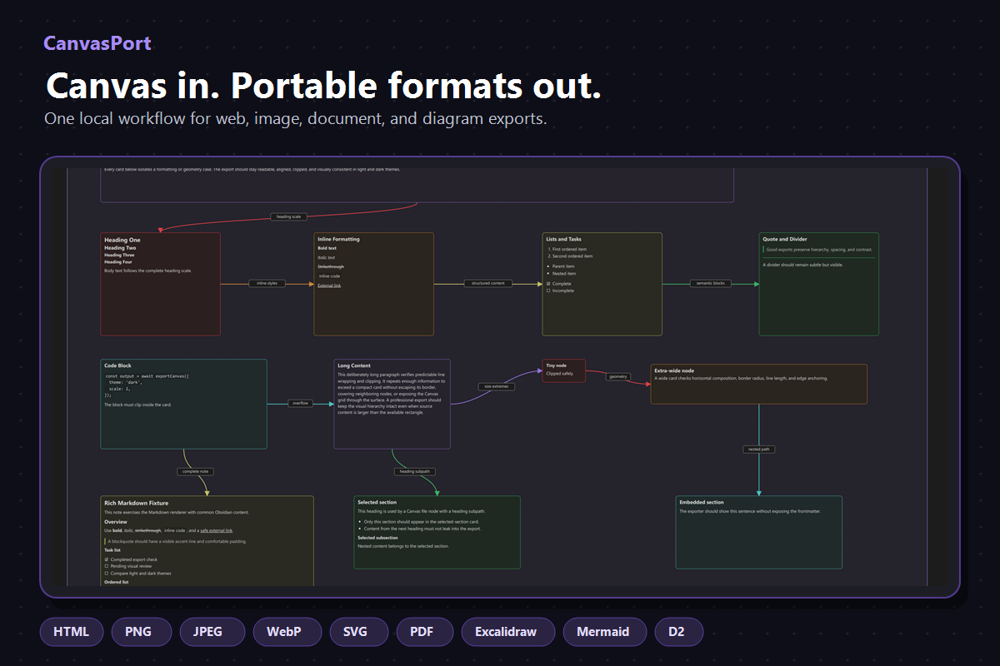
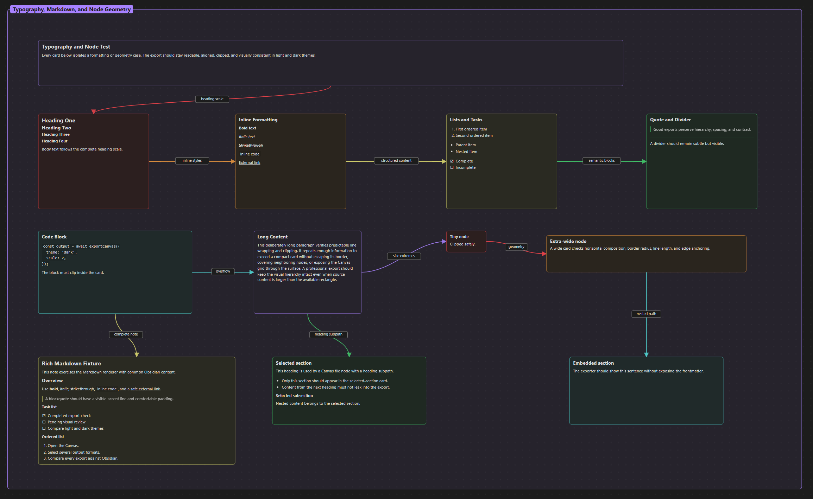
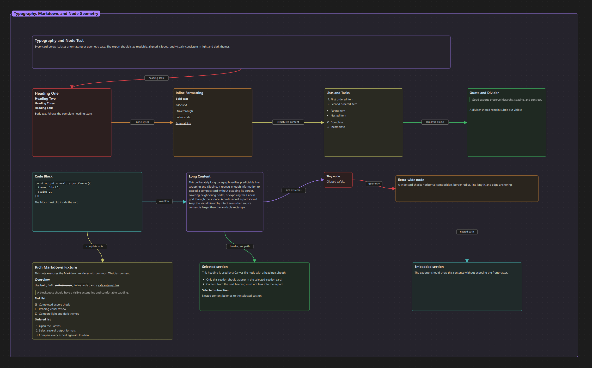
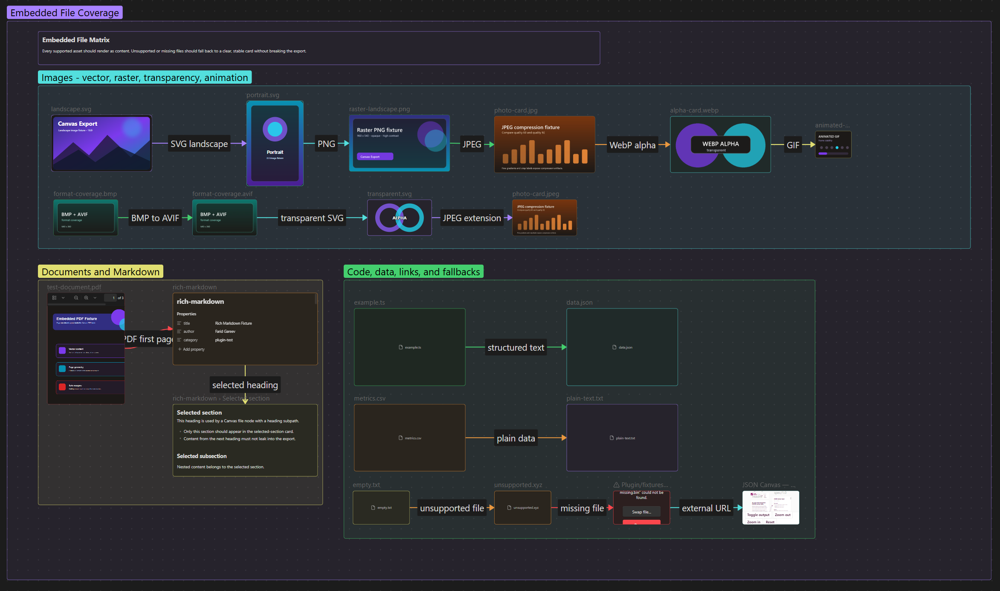
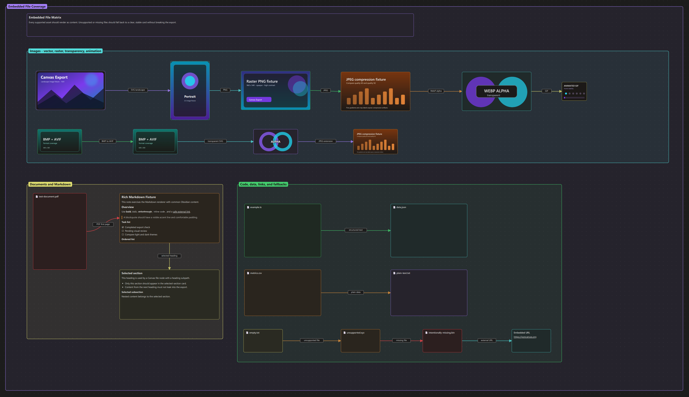
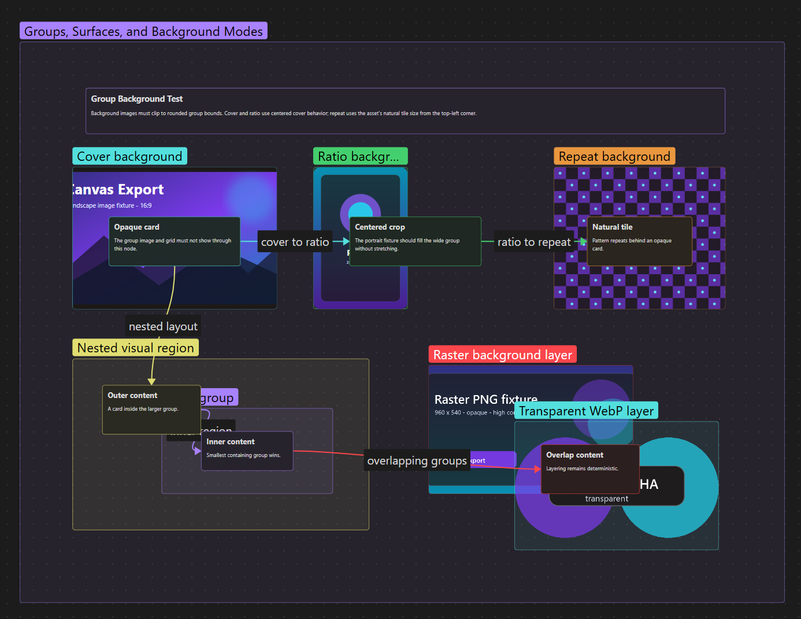
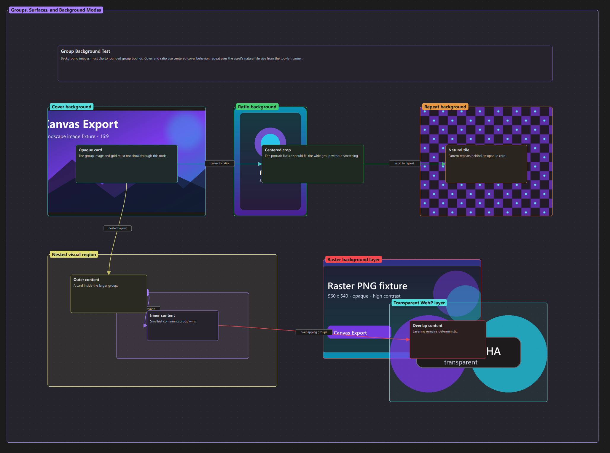

<!--
  CanvasPort
  SPDX-License-Identifier: Apache-2.0
-->

# CanvasPort for Obsidian

Take any [Obsidian Canvas](https://obsidian.md/canvas) anywhere. CanvasPort is a local-first desktop plugin that turns Canvas files into self-contained HTML, PNG, JPEG, WebP, SVG, PDF, Excalidraw, Mermaid, or D2 without sending vault data to an external service.

**Canvas in. Portable formats out.** Export once for documentation, publishing, printing, presentations, or diagram-as-code workflows.

[](docs/community/01-portable-formats.png)

## Visual examples

These regression tests compare the original Obsidian Canvas with the PDF produced by CanvasPort. Click any image to inspect the full-resolution result.

### Typography, Markdown, and node geometry

| Obsidian Canvas | Exported PDF |
| --- | --- |
| [](imgs/obsidian_test_01.png) | [](imgs/exported_pdf_test_01.png) |

### Embedded files and format coverage

| Obsidian Canvas | Exported PDF |
| --- | --- |
| [](imgs/obsidian_test_03.png) | [](imgs/exported_pdf_test_03.png) |

### Groups, surfaces, and backgrounds

| Obsidian Canvas | Exported PDF |
| --- | --- |
| [](imgs/obsidian_test_04.png) | [](imgs/exported_pdf_test_04.png) |

## What CanvasPort does

- Exports one canvas to several formats in a single action.
- Applies one clear light, dark, or Obsidian-matched theme to every visual export.
- Creates PNG, JPEG, WebP, and SVG visuals for documentation and sharing.
- Converts Canvas structure into Excalidraw, Mermaid, and D2 diagrams.
- Keeps canvas groups, connections, text, file content, and labels in the rendered output where the target format supports them.
- Embeds images directly and places the first page of each Canvas PDF node into PDF exports at full vector quality.
- Lets you choose an output folder and safely overwrite, rename, or skip existing exports.
- Offers grid, group-label, transparent-background, image-scale, and image-quality controls.
- Lets visual exports match Obsidian’s current theme or use a fixed light or dark appearance.

## Supported Obsidian Canvas export formats

| Format | Best for |
| --- | --- |
| HTML | Publishing or sharing a self-contained visual canvas page |
| PNG, JPEG, WebP | Images for notes, docs, social posts, and presentations |
| SVG | Sharp scalable graphics and documentation |
| PDF | Printable or archival exports |
| Excalidraw | Continuing visual work in Excalidraw |
| Mermaid | Version-controlled text diagrams |
| D2 | Diagram-as-code workflows |

## Included test suite

The repository includes a self-contained Obsidian test dataset in [`tests/dataset/`](tests/dataset/README.md). It provides eight focused Canvas files, reusable image and document fixtures, and expected-result documentation for repeatable visual regression testing.

- Start with [`00 - Test Suite Dashboard.canvas`](tests/dataset/00%20-%20Test%20Suite%20Dashboard.canvas).
- Use [`reference/Expected Results.md`](tests/dataset/reference/Expected%20Results.md) for format-by-format acceptance checks.
- Record manual verification in [`reference/Test Run Template.md`](tests/dataset/reference/Test%20Run%20Template.md).
- Keep generated exports outside the dataset or in temporary test-output folders.

## Install locally in Obsidian

CanvasPort requires the desktop version of Obsidian because image and PDF rendering use Electron APIs.

### Install from a GitHub release

1. Download `main.js`, `manifest.json`, and `styles.css` from the [latest release](https://github.com/FaridGareev/obsidian-canvasport/releases/latest).
2. Create `<your-vault>/.obsidian/plugins/canvasport/`.
3. Copy the three downloaded files into that folder.
4. Restart Obsidian, open **Settings → Community plugins**, and enable **CanvasPort**.

### Build from source

1. Download or clone this repository.
2. In the project folder, install Node.js dependencies and build the plugin:

   ```bash
   npm install
   npm run build
   ```

3. Create `<your-vault>/.obsidian/plugins/canvasport/`.
4. Copy the three files from `build/` into that folder: `main.js`, `manifest.json`, and `styles.css`.
5. Restart Obsidian, open **Settings → Community plugins**, and enable **CanvasPort**.

## Using the plugin

Open a `.canvas` file, then use one of these commands from Obsidian’s Command Palette:

- **Export current canvas…** — choose one or more formats and export options.
- **Export to [format]** — export directly to a chosen format.
- **Re-export with last settings** — repeat the last export selection.

You can also right-click a Canvas file in the file explorer and choose **Export canvas…**.

## Development

CanvasPort requires Node.js 20 or later and npm.

```bash
npm install
npm run verify
```

`npm run verify` validates publication metadata and test fixtures, runs Obsidian's official ESLint rules, checks TypeScript, executes exporter tests, and creates a production build. Use `npm run dev` to rebuild while developing. `npm run build` always writes a ready-to-copy plugin package to `build/`.

### Project structure

- `src/application` — plugin lifecycle and Obsidian commands
- `src/exporters` — HTML, SVG, diagram, and Excalidraw exporters
- `src/lib` and `src/models` — Canvas parsing, text formatting, and domain types
- `src/services` — vault I/O and Electron rendering
- `src/ui` — settings and export dialogs
- `tests` — automated exporter tests
- `tests/dataset` — complete Obsidian Canvas QA dataset and visual regression fixtures
- `imgs` — full-resolution README comparison screenshots

## Contributing

[Issues](https://github.com/FaridGareev/obsidian-canvasport/issues), feature ideas, documentation fixes, and pull requests are welcome. Please read [CONTRIBUTING.md](CONTRIBUTING.md) before opening a pull request.

## Changelog

See [CHANGELOG.md](CHANGELOG.md) for release notes.

## Privacy

CanvasPort runs locally inside Obsidian. It has no accounts, analytics, telemetry, advertising, or external API calls. Canvas content and embedded files remain on your device unless you choose to share an exported file.

## Origin and attribution

CanvasPort is a substantially modified derivative of [Canvas Export](https://github.com/rmoff/obsidian-canvas-export) by Robin Moffatt. The new name and plugin ID distinguish this derivative from the original community plugin. See [NOTICE](NOTICE) for attribution and modification details.

## License

CanvasPort is distributed under the [Apache License 2.0](LICENSE). You may use, modify, and distribute it subject to that license and the notices in [NOTICE](NOTICE).
